# Application Diagrams

This document contains comprehensive diagrams explaining the DocExtract application architecture, data flows, component relationships, and code organization.

## Table of Contents

1. [System Architecture Overview](#1-system-architecture-overview)
2. [Frontend Component Hierarchy](#2-frontend-component-hierarchy)
3. [Backend Service Architecture](#3-backend-service-architecture)
4. [Complete Document Processing Flow](#4-complete-document-processing-flow)
5. [Highlighting Flow](#5-highlighting-flow)
6. [API Endpoints Map](#6-api-endpoints-map)
7. [State Management Flow](#7-state-management-flow)
8. [Search Functionality Flow](#8-search-functionality-flow)
9. [File Organization Structure](#9-file-organization-structure)
10. [Component Dependency Graph](#10-component-dependency-graph)

---

## 1. System Architecture Overview

High-level view of the entire application stack.

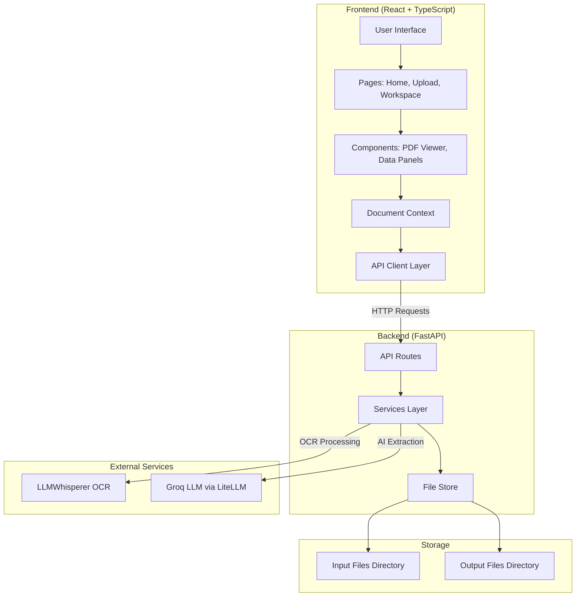

**Key Files:**
- Frontend Entry: `src/main.tsx` → `src/App.tsx`
- Backend Entry: `backend/main.py`
- API Client: `src/lib/api.ts`
- Context: `src/context/DocumentContext.tsx`

---

## 2. Frontend Component Hierarchy

Component tree showing how UI components are organized and nested.

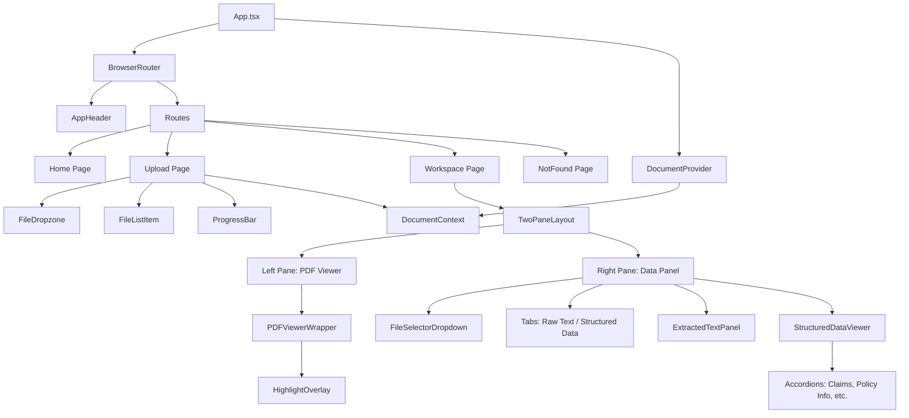

**Key Files:**
- Root: `src/App.tsx`
- Pages: `src/pages/Home.tsx`, `src/pages/Upload.tsx`, `src/pages/Workspace.tsx`
- Components: `src/components/workspace/*.tsx`
- Context: `src/context/DocumentContext.tsx`

---

## 3. Backend Service Architecture

Backend services and their relationships.

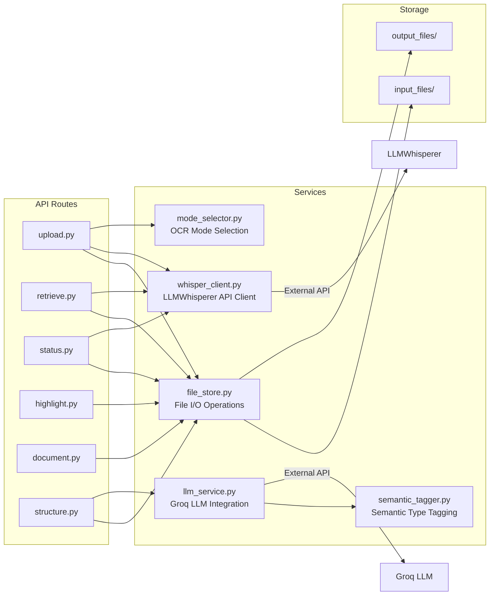

**Key Files:**
- Routes: `backend/routes/*.py`
- Services: `backend/services/*.py`
- Config: `backend/config.py`

---

## 4. Complete Document Processing Flow

End-to-end flow from file upload to structured data display.

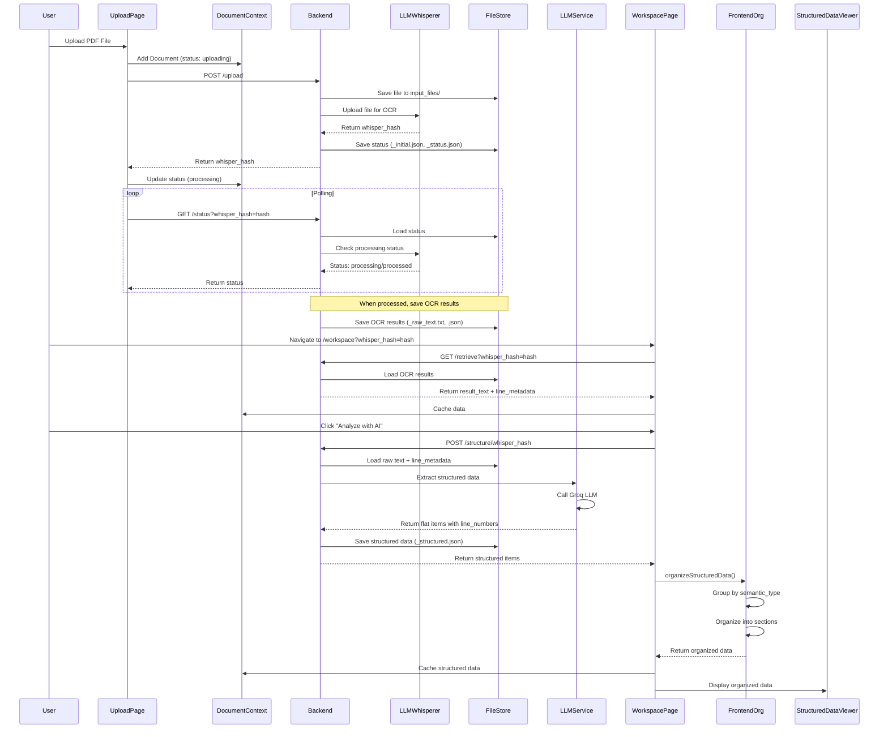

**Key Files:**
- Upload Flow: `src/pages/Upload.tsx`, `backend/routes/upload.py`
- Processing: `backend/services/whisper_client.py`
- Extraction: `backend/services/llm_service.py`
- Organization: `src/lib/organizeStructuredData.ts`

---

## 5. Highlighting Flow

How clicking a value highlights the corresponding location in the PDF.

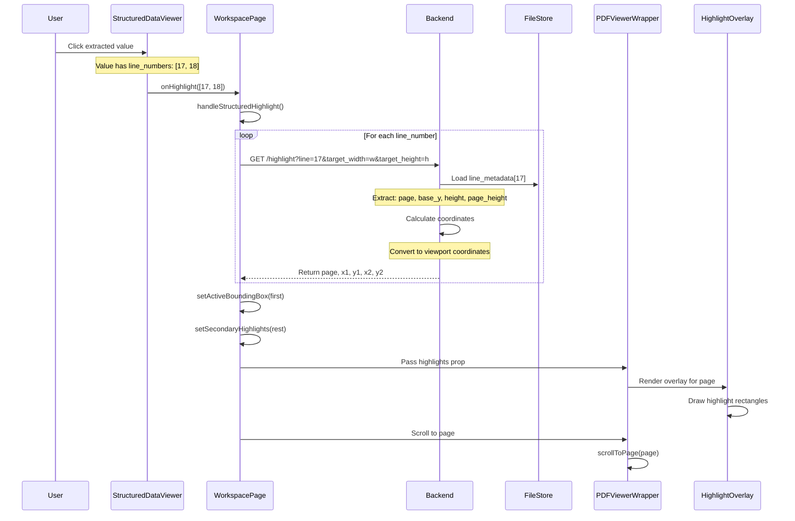

**Key Files:**
- Highlight Handler: `src/pages/Workspace.tsx` (handleStructuredHighlight)
- API: `backend/routes/highlight.py`
- Viewer: `src/components/workspace/PDFViewerWrapper.tsx`
- Overlay: `src/components/workspace/HighlightOverlay.tsx`

---

## 6. API Endpoints Map

All API endpoints and their relationships.

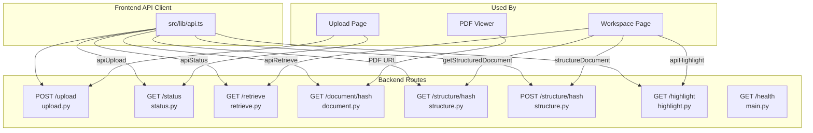

**Key Files:**
- API Client: `src/lib/api.ts`
- Routes: `backend/routes/*.py`
- Usage: `src/pages/Upload.tsx`, `src/pages/Workspace.tsx`

---

## 7. State Management Flow

How state flows through the application using React Context.

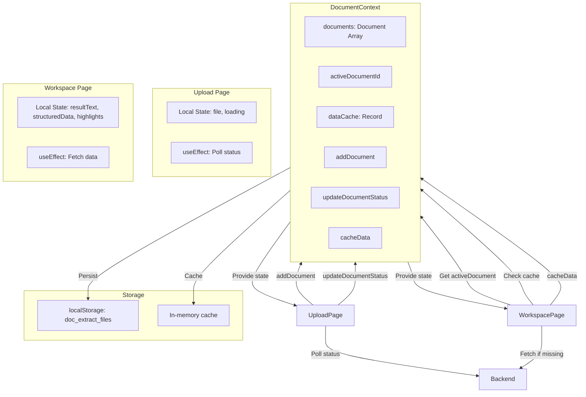

**Key Files:**
- Context: `src/context/DocumentContext.tsx`
- Usage: `src/pages/Upload.tsx`, `src/pages/Workspace.tsx`

---

## 8. Search Functionality Flow

How global search works across raw text and structured data.

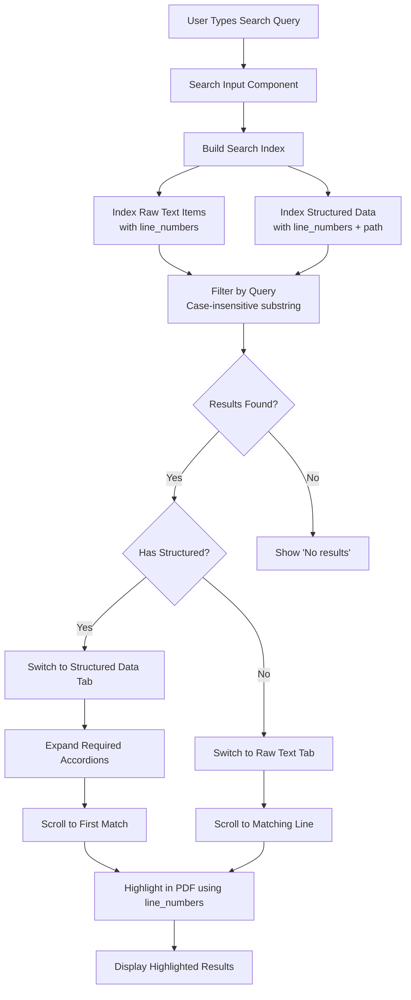

**Key Files:**
- Search Logic: `src/pages/Workspace.tsx` (searchIndex, searchResults)
- Text Highlighting: `src/components/workspace/ExtractedTextPanel.tsx`
- Structured Highlighting: `src/components/StructuredDataViewer.tsx`

---

## 9. File Organization Structure

Directory structure and what each major directory/file contains.

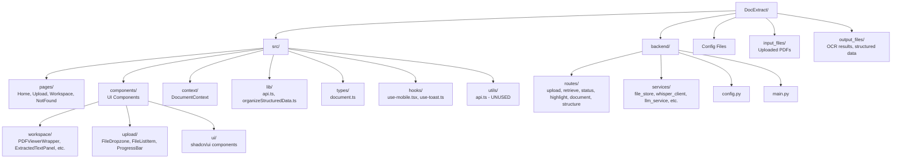

**Key Directories:**
- `src/pages/` - Main page components
- `src/components/workspace/` - Workspace-specific components
- `backend/routes/` - API endpoints
- `backend/services/` - Business logic

---

## 10. Component Dependency Graph

Detailed view of which components import and use which other components.

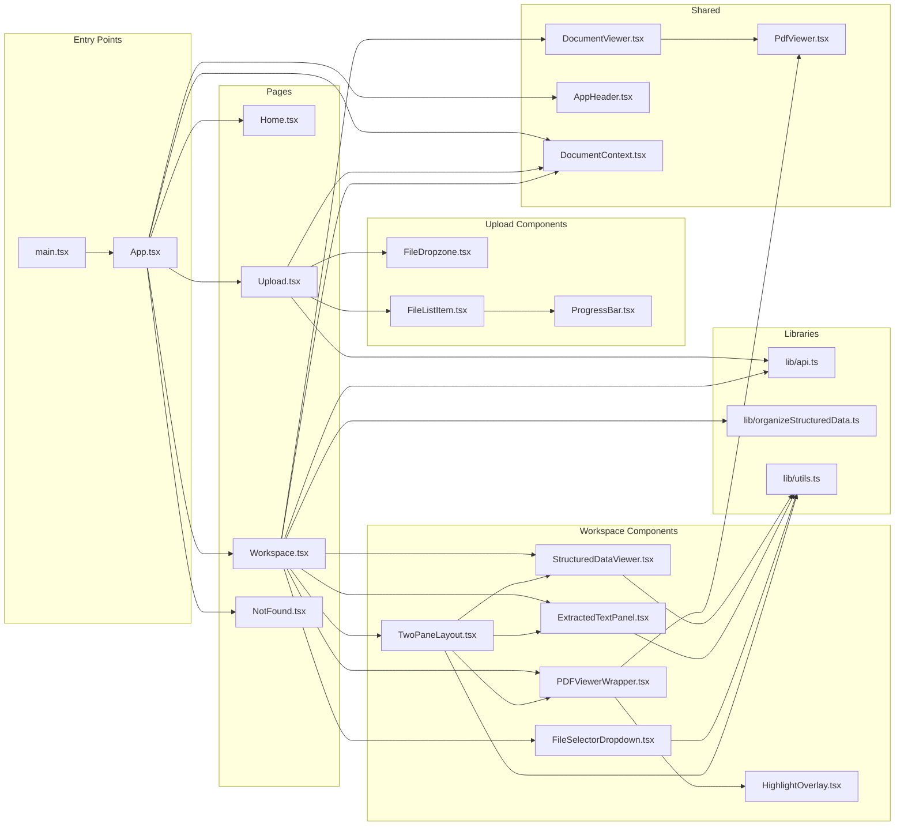

**Key Dependencies:**
- All components use: `@/lib/utils` (cn helper)
- API calls: `@/lib/api`
- State: `@/context/DocumentContext`
- Types: `@/types/document`

---

## 11. Data Flow: Upload to Display

Complete data transformation pipeline.

```mermaid
flowchart LR
    PDF[PDF File] --> Upload[Upload Endpoint]
    Upload --> SaveFile[Save to input_files/]
    Upload --> OCR[LLMWhisperer OCR]
    
    OCR --> RawText[Raw Text<br/>result_text]
    OCR --> LineMeta[Line Metadata<br/>line_metadata array]
    
    RawText --> Store1[Store in output_files/<br/>_raw_text.txt]
    LineMeta --> Store2[Store in output_files/<br/>hash.json]
    
    Store1 --> Retrieve[Retrieve Endpoint]
    Store2 --> Retrieve
    
    Retrieve --> Frontend1[Frontend: resultText]
    Retrieve --> Frontend2[Frontend: lineMetadata]
    
    Frontend1 --> DisplayText[Display in ExtractedTextPanel]
    Frontend2 --> HighlightCalc[Used for Highlight Calculations]
    
    Frontend1 --> LLMExtract[LLM Extraction]
    Frontend2 --> LLMExtract
    
    LLMExtract --> FlatItems[Flat Items Array<br/>key, value, line_numbers, semantic_type]
    
    FlatItems --> Store3[Store in output_files/<br/>hash_structured.json]
    Store3 --> Frontend3[Frontend: organizeStructuredData]
    
    Frontend3 --> Organized[Organized Sections<br/>Claims, Policy Info, Summary, Other]
    
    Organized --> DisplayStructured[Display in StructuredDataViewer]
    
    DisplayText --> UserClick1[User Clicks Text Line]
    DisplayStructured --> UserClick2[User Clicks Value]
    
    UserClick1 --> HighlightAPI[Highlight API]
    UserClick2 --> HighlightAPI
    
    HighlightAPI --> LineMeta
    LineMeta --> Coordinates[Calculate Coordinates]
    Coordinates --> PDFHighlight[Highlight in PDF Viewer]
```

**Key Transformations:**
- PDF → Raw Text + Line Metadata (OCR)
- Raw Text → Structured Items (LLM)
- Structured Items → Organized Sections (Frontend)
- Line Numbers → PDF Coordinates (Highlight API)

---

## 12. Code File Usage Map

Which code files are used for what purpose.

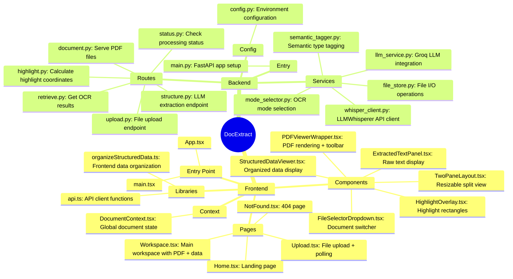

---

## Diagram Legend

### Component Types
- **Pages**: Top-level route components
- **Components**: Reusable UI components
- **Services**: Backend business logic
- **Routes**: API endpoints
- **Context**: React state management
- **Libraries**: Utility functions and helpers

### Flow Directions
- **→**: Data flow or function call
- **↔**: Bidirectional communication
- **⟳**: Loop or iteration
- **?**: Conditional logic

### Color Coding (in rendered diagrams)
- Blue: Frontend components
- Green: Backend services
- Orange: External services
- Purple: Storage/Data
- Yellow: User interactions

---

## How to Use These Diagrams

1. **For New Developers**: Start with "System Architecture Overview" and "Frontend Component Hierarchy"
2. **For Understanding Data Flow**: See "Complete Document Processing Flow" and "Data Flow: Upload to Display"
3. **For Debugging**: Use "Highlighting Flow" and "State Management Flow"
4. **For API Integration**: Refer to "API Endpoints Map"
5. **For Code Organization**: Check "File Organization Structure" and "Component Dependency Graph"

These diagrams are rendered using Mermaid and will display correctly on GitHub, GitLab, and most Markdown viewers that support Mermaid syntax.

