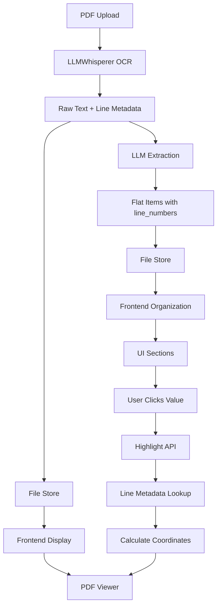
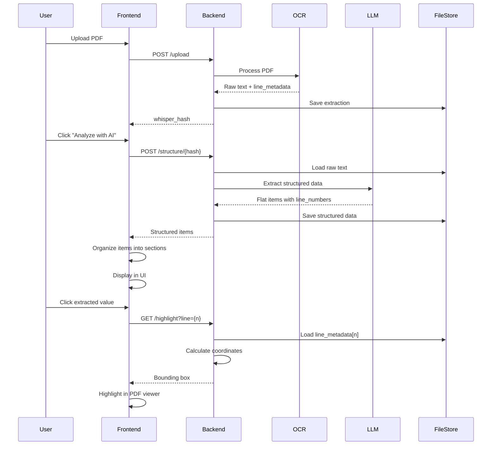

# DocExtract

**PDF document extraction and verification with line-number-based highlighting.**

## Purpose

Extract structured data from PDF documents and enable precise verification by highlighting the exact source location of each extracted value in the original document.

## Problem Statement

Traditional document extraction systems suffer from two issues:

1. **Verification difficulty**: Users cannot easily verify if extracted values are correct because there's no clear link between extracted data and its source location in the PDF.

2. **Data loss**: Unassigned or ambiguous fields are often discarded, making it impossible to review what was found but not categorized.

This application solves both by using line numbers as the single source of truth, enabling precise highlighting and preserving all extracted data.

## Core Design Principle

**Line numbers are the single source of truth.**

- OCR produces raw text with line numbers (0-based indices).
- AI extracts flat key-value pairs with `line_numbers` arrays (no grouping, no guessing).
- All grouping and UI organization is deterministic and happens in the frontend.
- Clicking any extracted value highlights the exact line(s) in the PDF using line numbers.
- Zero data loss: unassigned fields remain visible in an "Other / Unclassified" section.

## Architecture



## Document Processing Flow



## Data Contracts

### Raw Extraction Format

After OCR, the backend stores:

```json
{
  "result_text": "Line 1 text\nLine 2 text\n...",
  "line_metadata": [
    [page, base_y, height, page_height],
    [page, base_y, height, page_height],
    ...
  ]
}
```

- `result_text`: Raw text with newlines separating lines
- `line_metadata`: Array of arrays, one per line
  - `page`: 0-based page number
  - `base_y`: Baseline Y coordinate in page space
  - `height`: Line height in page space
  - `page_height`: Total page height in page space

### AI Output Format

The LLM returns flat items with no grouping:

```json
{
  "items": [
    {
      "key": "Claim Number",
      "value": "01000225",
      "line_numbers": [17, 18],
      "semantic_type": "claim.claim_number"
    },
    {
      "key": "Loss Date",
      "value": "2024-01-15",
      "line_numbers": [20],
      "semantic_type": "claim.loss_date"
    }
  ]
}
```

- `key`: Field name (as extracted, no normalization)
- `value`: Extracted value (as string)
- `line_numbers`: Array of 0-based line indices where this value appears
- `semantic_type`: Optional semantic classification (used for grouping)

**Important**: The LLM does not group items into claims, sections, or categories. All grouping happens deterministically in the frontend based on `semantic_type` and line number proximity.

## Highlighting Logic

The highlighting system works entirely from line numbers—no coordinates come from the AI.

1. **User clicks a value** with `line_numbers: [17, 18]`
2. **Frontend calls** `GET /highlight?whisper_hash={hash}&line=17&target_width={w}&target_height={h}`
3. **Backend looks up** `line_metadata[17]` from the stored extraction
4. **Backend calculates** bounding box coordinates:
   - Extracts `[page, base_y, height, page_height]` from metadata
   - Converts to viewport coordinates using `target_width` and `target_height`
   - Returns `{page, x1, y1, x2, y2}`
5. **Frontend highlights** the bounding box in the PDF viewer using PDF.js

The AI never provides coordinates. All coordinate calculations use the line metadata from OCR.

## Key Features

- **Line-number-based highlighting**: Click any extracted value to see its exact location in the PDF
- **Zero data loss**: All extracted fields are visible, including unassigned ones
- **Deterministic grouping**: UI organization is predictable and consistent
- **Global search**: Search across raw text and structured data with auto-tab switching
- **Resizable split view**: Adjustable PDF viewer and data panel widths
- **Fullscreen PDF view**: Toggle fullscreen mode for focused viewing
- **Reset view**: Quick reset to 100% zoom, page 1, top position

## Tech Stack

| Component | Technology |
|-----------|-----------|
| Frontend Framework | React 18 + TypeScript |
| Build Tool | Vite |
| UI Components | Radix UI + shadcn/ui |
| Styling | Tailwind CSS |
| Routing | React Router v6 |
| PDF Rendering | PDF.js |
| Backend Framework | FastAPI |
| OCR Engine | LLMWhisperer |
| LLM Provider | Groq (via LiteLLM) |
| State Management | React Context API |

## Local Setup

### Prerequisites

- Python 3.10+
- Node.js 18+
- Groq API key (for LLM extraction)

### Backend Setup

1. Navigate to the project root:
   ```bash
   cd backend
   ```

2. Create a virtual environment:
   ```bash
   python -m venv venv
   source venv/bin/activate  # On Windows: venv\Scripts\activate
   ```

3. Install dependencies:
   ```bash
   pip install fastapi uvicorn litellm
   # Add other dependencies as needed
   ```

4. Set environment variables:
   ```bash
   cp env.example .env
   # Edit .env and set GROQ_API_KEY
   ```

5. Start the backend server:
   ```bash
   uvicorn backend.main:app --reload --port 8000
   ```

### Frontend Setup

1. Install dependencies:
   ```bash
   npm install
   ```

2. Start the development server:
   ```bash
   npm run dev
   ```

3. Open `http://localhost:5173` (or the port shown in terminal)

### Configuration

- Backend CORS origins are configured in `backend/config.py`
- Frontend API base URL is configured in `src/lib/api.ts`
- Input/output directories are set in `backend/config.py`

## Known Limitations

1. **Line-based highlighting only**: Highlights span full line width. Multi-line values may highlight adjacent lines.

2. **OCR dependency**: Highlighting accuracy depends on LLMWhisperer's line detection. Poor OCR quality affects line number accuracy.

3. **No coordinate refinement**: The AI does not provide precise bounding boxes. Highlighting uses line-level granularity.

4. **Deterministic grouping assumptions**: Frontend grouping assumes semantic types follow naming conventions (e.g., `claim.*`, `policy.*`). Non-standard types may be misclassified.

5. **Single LLM provider**: Currently hardcoded to Groq. Changing providers requires code changes.

6. **No batch processing**: Documents are processed one at a time. No queue system for multiple uploads.

## Future Improvements

- Support for multiple LLM providers via configuration
- Batch document processing with queue system
- Coordinate refinement using vision models for precise bounding boxes
- Export extracted data to CSV/Excel
- User-defined field mappings and validation rules
- Multi-page highlighting for values spanning multiple lines
- Caching layer for repeated document processing
